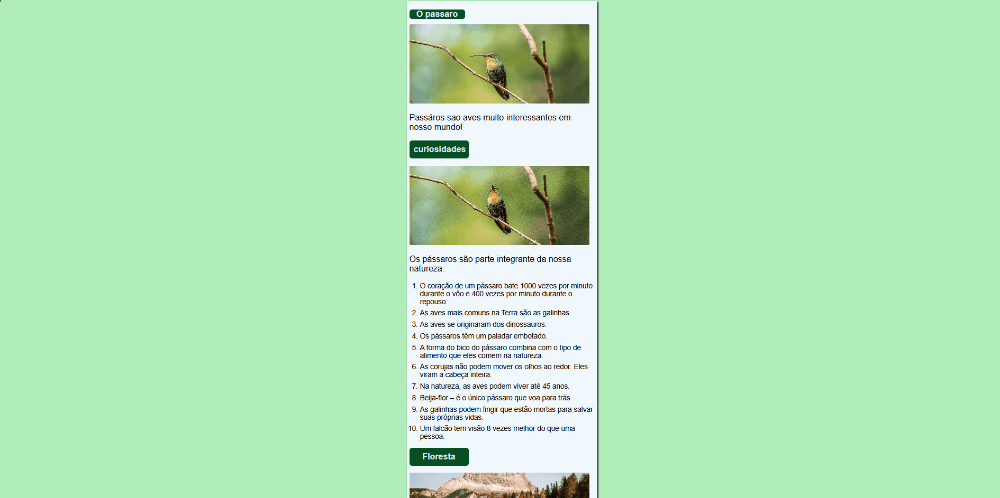
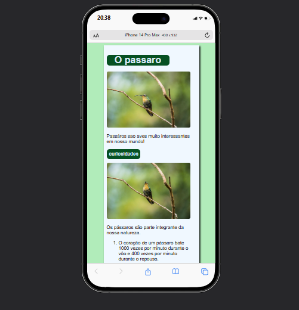

# Projeto: Informações sobre a Natureza 🌿
 projeto de um site criado durante um curso de git e github do curso em video.   
fiz algumas mudanças para deixar responsivo feito, utilizando a técnica **Mobile First** para garantir uma ótima experiência em dispositivos móveis. O objetivo é apresentar informações sobre pássaros e florestas de forma agradável e acessível.

## ✨ Funcionalidades

- Exibição de informações sobre pássaros e florestas.
- Design limpo e minimalista com foco em conteúdo.
- Layout responsivo adaptado para dispositivos móveis e desktops.

## 🎯 Tecnologias Utilizadas

- **HTML5**: Estrutura e conteúdo do projeto.
- **CSS3**: Estilização e design responsivo com a abordagem Mobile First.

 ## imagem do projeto
 

